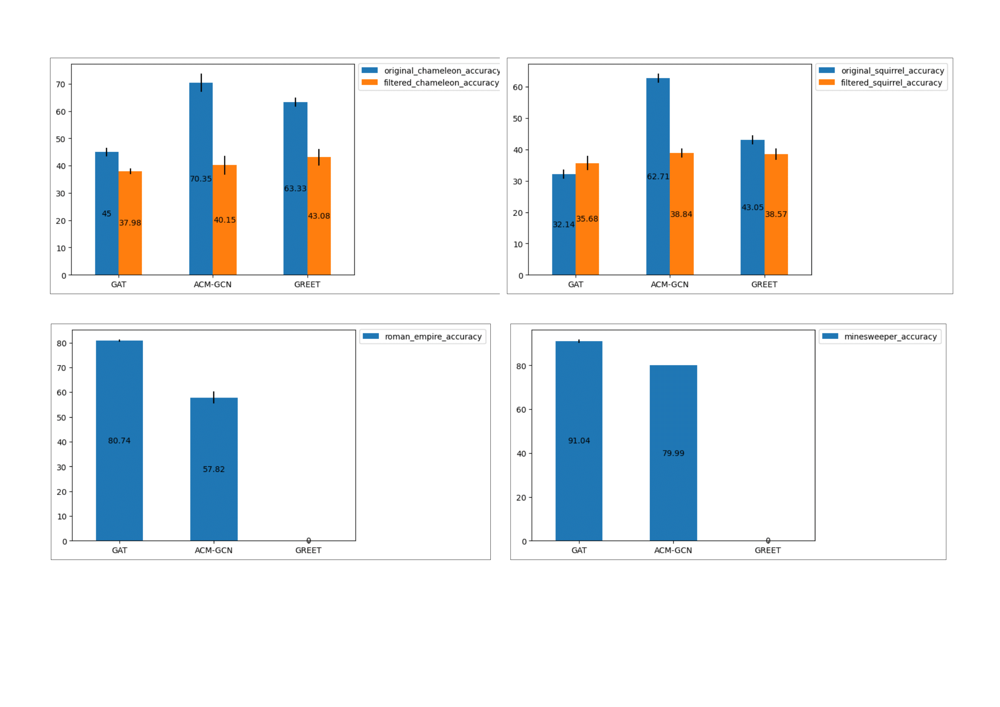

# 2024_filtered_heterophily_graph_data_test

[comment]: <=================================================================================> 

## 실험 선정

### 실험 제목

- ACM과 GREET에 대한 기존 이질 링크 그래프의 사본 이슈로 인한 성능 저하 정도 확인 및 신규 이질 링크 그래프에 대한 학습 수준 측정

### 실험 목적

- PyTorch와 PyG, DGL 등 주요 실험 도구의 사용법 익히기
- GAT를 대조 모델로 설정하고 6가지 데이터셋에 대한 노드 분류 결과 확인하기
- ACM과 GREET을 실험 모델로 설정하고 6가지 데이터셋에 대한 노드 분류 결과 확인하기

[comment]: <=================================================================================> 

## 실험 설계

### 데이터셋 통계 정보

| dataset | nodes | edges |
|---|:---:|---:|
| `chameleon`          | 2,277  | 36,051 |
| `squirrel`           | 5,201  | 216,933|
| `filtered chameleon` | 890    | 14,474 |
| `filtered squirrel`  | 2,223  | 67,941 |
| `roman-empire`       | 22,662 | 32,927 |
| `minesweeper`        | 10,000 | 39,402 |

### 추상적 절차

- 6가지 데이터셋에 대한 GAT의 노드 분류 성능 확인
- original/filtered chameleon, squirrel에 대한 ACM, GREET, DGI의 노드 분류 성능 확인
- roman-empire, minesweeper에 대한 ACM, GREET, DGI의 노드 분류 성능 확인 

### 실험 조건 설정

- ACM과 Yandex는 supervised, GREET만 unsupervised
- Yandex가 제시한 **50/25/25** split 데이터를 실험에 이용

[comment]: <=================================================================================> 

## 결과 예측

- 50/25/25의 비율로 split한 Chameleon과 Squirrel 데이터셋의 경우 ACM은 GAT보다 높은 성능을 보일 것으로 예상함

- GREET의 경우 비지도 방식이기 때문에 ACM, GAT와의 비교가 불가능하며 그럼에도 훈련에 이용한 데이터의 비율이 기존보다 상승하였기 때문에 공식 결과와 비슷한 수준이거나 조금 더 향상된 성능을 보일 것으로 예상함

- GloGNN의 경우 filtered 데이터셋에 대한 노드 분류 성능은 기존에 비해 Chameleon에서 37%, Squirrel에서 58% 수준으로 하락하였기 때문에 ACM과 GREET도 기존 성능의 절반 수준으로 노드 분류 성능이 하락할 것으로 예상함

- GloGNN을 고려할 때 Roman과 MinesWeeper 데이터셋에 대한 노드 분류 성능은 GAT가 ACM을 큰 폭으로 앞지를 것으로 예상함 

[comment]: <=================================================================================> 

## 실험 수행 및 결과 분석

### 수행 중 주요 이슈

#### 그래프 객체 호환 문제

- Yandex의 GAT를 훈련 시킨 그래프 객체와 ACM을 훈련 시킬 그래프 객체를 일치시키는 과정에서 문제가 발생함

- Yandex 코드는 DGL 그래프 객체를 이용해서 모델을 훈련 시킴

- ACM 모델은 Networkx 객체를 이용해서 그래프 자료구조를 만든 뒤 txt 파일을 읽어 노드와 링크를 생성함

- 그리고 Networkx 그래프 객체를 Scipy의 sparse matrix 객체로 변형한 뒤 Pytorch의 sparse API를 이용해서 모델을 훈련 시킬 그래프 객체를 생성함

- **DGL 라이브러리 기반 그래프 데이터를 만든 뒤, 해당 객체로부터 그래프 생성에 필요한 정보(nodes, edges, features, labels)를 다시 추출하여 새로운 그래프 객체를 생성함으로써 해결함**

#### 메모리 문제

- GREET 모델의 경우 roman-empire, minesweeper 데이터를 학습하는 과정에서 메모리 초과 문제(OOM)가 발생함

- 도시과학박데이터 서버를 통한 실험 시도

### 결과 분석

- 목적했던 대조군과 실험군의 노드 분류 결과를 비교하였음

- ACM의 경우 기존 노드 분류 성능 대비 filtered chameleon에서는 57%, filtered squirrel에서는 62% 수준으로 하락함

- GREET의 경우 기존 노드 분류 성능 대비 filtered chameleon에서는 68%, filtered squirrel에서는 90% 수준으로 하락함

- 위 결과를 바탕으로 대표적인 이질 링크 그래프(chameleon, squirrel)에 대한 학습이 사본이 존재하는 잘못된 이질 링크 그래프에서 이루어져 왔음을 직접 확인할 수 있었음

- Yandex가 새로 제시한 데이터셋 중 roman-empire와 minesweeper에 대한 결과를 GAT와 ACM에 대해서 비교했을 때, 기존 이질 링크 그래프 학습에 집중한 모델들이 되려 표준 그래프 신경망 모델보다 낮은 노드 분류 성능을 보였음을 확인함 

- **이를 통해 기존 이질 링크 그래프에 대한 학습 매커니즘이 새로운 이질 링크 그래프에 대해서는 적합하지 않음을 확인함**

- pandas에 내장된 plot 라이브러리를 이용하여 노드 분류 결과를 시각화함

<!--  -->

