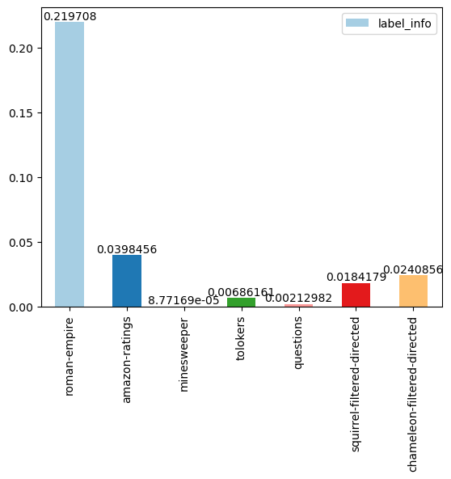
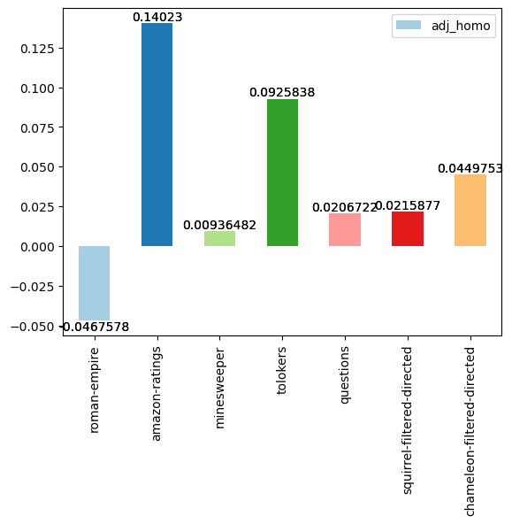
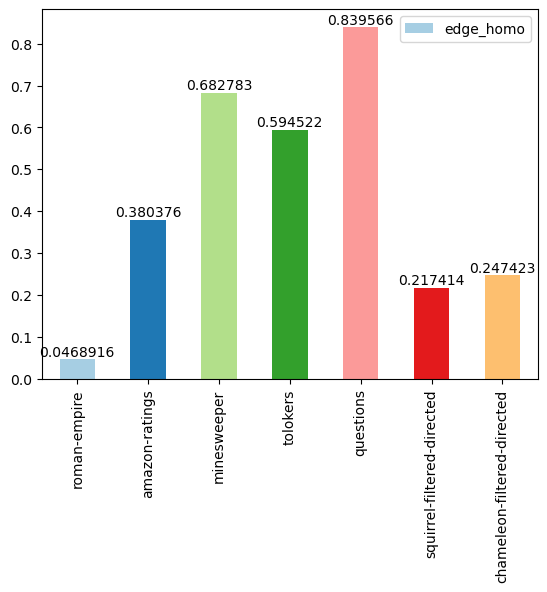

# 20240116_MiniProject_AdjHomo_LabelInfo

[comment]: <=================================================================================> 

## 프로젝트 소개

### 프로젝트 제목

- 이질 링크 데이터셋의 Adjusted Homophily와 Label Information 측정

### 프로젝트 목적

- [Adjusted Homophily(AH)와 Label Information(LI)](https://arxiv.org/pdf/2209.06177.pdf)를 계산하는 함수 구현

- filtering된 chameleon과 squirrel 데이터셋에 대한 AH와 LI를 계산하여 다른 데이터셋과 비교

[comment]: <=================================================================================> 

## 주요 구현 내용

- Yandex 팀의 논문에 제시된 통계 정보와 일치하는 결과가 나오도록 구현

- DGL 라이브러리를 기반으로 하는 `YandexDataLoader` 클래스를 정의하여 제공된 데이터셋들을 관리 

- `get_p_bar_k` 함수는 각 클래스별 차수의 총합을 전체 링크의 2배수로 정규화한 값을 저장하는 딕셔너리를 반환함 

- `get_p_c1_and_c2` 함수는 링크를 구성하는 각 노드의 레이블을 확률변수로 하는 확률분포를 계산하기 위해 존재하는 링크 집합 내의 각 노드 페어가 각각 c1, c2 클래스인 경우의 총 개수를 링크의 총 개수로 나눠서 구함 

[comment]: <=================================================================================> 

## 결과 분석

- LI를 통해 클래스 간의 종속성 정도를 측정할 수 있음

- 클래스의 개수가 5개로 동일하고 GAT 기준 상대적으로 노드 분류 성능이 유사한 filtered chameleon, squirrel 그리고 amazon-ratings의 경우 LI와 노드 분류 성능 사이에 양의 상관관계를 보임

- AH 결과 역시 5개의 클래스를 갖는 세 데이터셋에 대해서는 양의 상관관계를 보임
