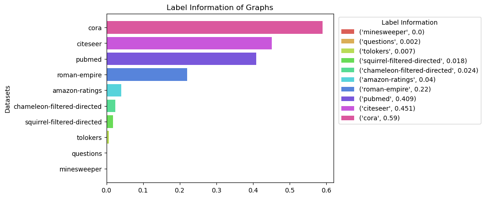
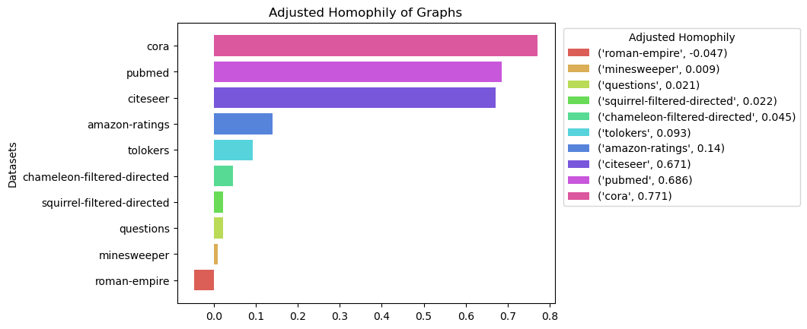
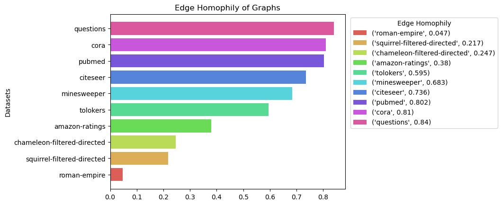

# 240118_CoreStatisticsComparison

<!--  --> 

## 프로젝트 소개

### 프로젝트 제목

- 동질 간선 그래프와 이질 간선 그래프의 주요 성질 비교

### 프로젝트 목적

- Cora, Citeseer, Pubmed로 대표되는 동질 간선 그래프의 Label Information과 Adjusted Homophily 값 확인하기

- 위 결과를 바탕으로 ACM과 LightGCN의 핵심 알고리즘을 이용할 수 있는 빈틈 조사하기

<!--  -->

## 주요 구현 내용

- `load_data_with_pyg` 함수를 이용해 파이토치 Geometric 라이브러리로부터 Cora, Citeseer, Pubmed 데이터를 다운 받음 

- 각 데이터를 로드한 뒤 `get_dataset_dict` 함수를 이용하여 데이터셋의 주요 정보들을 기록하는 딕셔너리를 초기화함 

    - 주요 관심 정보는 Label Information, Adjusted Homophily, Edge Homophily 

    - heterophily 데이터셋에 대해 위 정보들을 계산하는 함수를 그대로 이용하되 데이터셋 딕셔너리를 인자로 전달받아 처리할 수 있도록 구현함 

- 데이터셋 딕셔너리를 바탕으로 DataFrame 객체를 생성함

- 기존 heterophily 데이터셋들에 대한 주요 정보들이 저장된 csv 파일을 로드하여 homophily 데이터셋들과의 시각적 비교를 할 수 있는 함수, `plot_comparison_of_xxx` 함수를 구현함 

    - xxx: [label_info, adj_homo, edge_homo]

<!--  -->

## 결과 분석

### 시각화 자료를 이용한 결과 분석

- cora, citeseer, pubmed는 node classification의 대표적인 benchmark 데이터셋으로 homophily graph로 분류되곤 함 

- heterophily 데이터 중 가장 높게 측정되었던 roman-empire보다 최소 1.8배 이상의 Label Information을 관찰하였음 

- `papers with code`를 기준으로 ACM은 cora에서 89.59%, citeseer에서는 82.07%, pubmed에서는 91.44%의 노드 분류 성능을 기록하였음 

    - 표준 편차는 최대 1.6% 미만 

- Label Information과 ACM의 노드 분류 성능 사이에는 뚜렷한 상관관계가 관찰되지는 않았음 

- heterophily 데이터보다 최소 4.7배 이상 높았음 

- 아래의 Edge Homophily 결과와 비교할 때 homophily 그래프와 heterophily 그래프 사이의 명확한 차이를 제시하고 있음  

    - Edge Homophily 결과에서 84%로 측정된 questions는 heterophily 그래프 데이터로 간주함([Platonov et al., 2023](https://arxiv.org/pdf/2209.06177.pdf))

### 향후 작업

- 프로젝트의 목적으로 설정하였던 ACM과 LightGCN 간의 비교를 수행하지 않았음 

- homophily 데이터섯에 대한 ACM의 우수한 성능이 명료하지 않은 상황이므로 이에 대한 공부를 우선적으로 수행하고자 함 

- 이 과정에서 ACM이 chameleon, squirrel과 같이 문제가 있는 데이터셋들([Platonov et al., 2023](https://arxiv.org/pdf/2209.06177.pdf))에 대해서도 높은 정확도를 보인 원인을 탐구하고 이를 제거 또는 수정할 수 있는지에 대한 프로젝트를 계획함